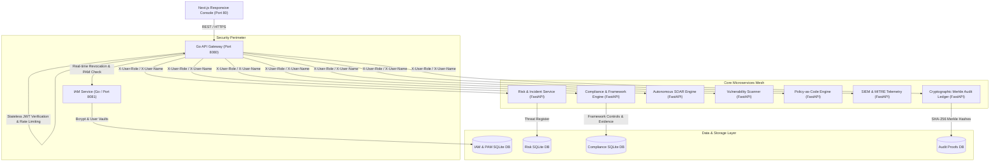

# 🛡️ Sentinel-GRC: Enterprise Cyber-GRC Platform

[](https://golang.org/)
[](https://nextjs.org/)
[](https://fastapi.tiangolo.com/)
[](https://www.docker.com/)
[](https://owasp.org/)
[](https://csrc.nist.gov/)
[](https://opensource.org/licenses/MIT)

**Sentinel-GRC** is an enterprise-grade Governance, Risk, and Compliance (GRC) and Security Operations Center (SOC) platform. Engineered on a distributed 11-microservice mesh, Sentinel-GRC unifies identity lifecycle governance, granular cloud asset allocation, automated threat triage, continuous compliance audits, and cryptographic evidence verification into a single real-time console.

---

## 🏛️ System Architecture



---

## ✨ Core Platform Modules

### 1. 🏢 Multi-Tenant Client Organizations
* **Dynamic Client Onboarding:** Provision client organizations dynamically with custom SLA thresholds (`99.99%`, `99.95%`), tier classifications (`Financial-Grade`, `Enterprise`, `Standard`), and allocated seat limits.
* **Complete Lifecycle Management:** 1-click client removal and tenant-scoped security.

### 2. ☁️ Cloud Asset Inventory & Multi-Tier Allocation
* **Dynamic Asset Registration:** Register custom infrastructure (Kubernetes Clusters, PostgreSQL Databases, S3 Storage Vaults, VPCs, API Gateways, Firewalls).
* **Granular Multi-Level User Allocation:** Allocate any asset to any user with explicit access levels:
  * `Read`: Telemetry, metrics, and log review only.
  * `Write`: Modify configurations and security policies.
  * `Operator`: Deploy code, trigger SOAR playbooks, and restart workloads.
  * `Admin`: Full IAM policy, permission assignment, and root controls.
  * `Auditor`: Merkle audit log verification and compliance inspection.
* **Instant Revocation:** 1-click immediate access revocation.

### 3. ⏱️ Just-In-Time (JIT) Privileged Access Management
* **Time-Bound Leases:** Request temporary elevation with Jira/ServiceNow ticket justifications and auto-expiring TTLs (15 to 480 minutes).
* **Manager Review Queue:** Approve or reject elevation requests in real-time.

### 4. 🤖 Autonomous SOAR & Incident Response
* **Automated Playbooks:** Trigger automated containment playbooks (IP Blocking, Credential Revocation, Quarantine Isolation, Snapshot Creation).
* **Real-time Execution:** WebSocket-streamed playbook telemetry with audit trails.

### 5. 🔍 Continuous Vulnerability Scanner
* **Automated Asset Auditing:** Scan managed cloud assets for CVEs, exposed credentials, misconfigured S3 buckets, and unpatched dependencies.
* **1-Click Remediation:** Instant automated patch triggers with audit logging.

### 6. 📜 Cryptographic Merkle Audit Ledger
* **Tamper-Evident Logs:** Every security event, user allocation, and compliance change is hashed into an immutable Merkle tree ledger.
* **Cryptographic Verification:** Export verifiable SHA-256 cryptographic proofs for external regulators and auditors.

### 7. 🛡️ Multi-Framework Compliance Engine
* **Pre-Mapped Standards:** Out-of-the-box controls for **ISO/IEC 27001:2022**, **NIST CSF 2.0**, and **SOC 2 Type II**.
* **Evidence Locker:** Attach technical audit evidence, auditor timestamps, and live readiness scoring.

---

## 🔒 Security Principles & Git Sanitization

* **Zero Hardcoded Secrets:** All credentials, JWT secrets, and admin passwords are completely externalized into environment variables.
* **Git Protection (`.gitignore`):** Runtime SQLite databases (`*.db`, `iam-data/`), environment configs (`.env`), and private keys are strictly excluded from version control.
* **Clean Public Template:** External users receive only `.env.example` and must initialize their own fresh admin password and secret keys.
* **Zero-Trust Network Perimeter:** Microservices run inside an isolated Docker bridge network with rate limiting and stateless HMAC-SHA256 JWT validation.

---

## 🚀 Quick Start Guide

### Prerequisites
* [Docker Desktop](https://www.docker.com/products/docker-desktop/) (Docker Engine 20.10+ and Docker Compose v2)
* [Git](https://git-scm.com/)

### 1. Clone the Repository
```bash
git clone https://github.com/lingeshkumar-ctrl/sentinel-grc.git
cd sentinel-grc
```

### 2. Configure Environment Secrets
Copy the `.env.example` template to `.env`:
```bash
cp .env.example .env
```
Open `.env` in any editor and set your secure keys:
```env
JWT_SECRET=generate_a_random_32_character_string_here
INITIAL_ADMIN_USERNAME=admin
INITIAL_ADMIN_PASSWORD=YourCustomAdminPassword123!
```

### 3. Launch the Platform
```bash
docker compose up --build -d
```

### 4. Access the Application
* **Frontend Web Console:** [http://localhost](http://localhost)
* **API Gateway Health:** [http://localhost:8080/health](http://localhost:8080/health)
* **IAM Service Health:** [http://localhost:8081/health](http://localhost:8081/health)

Log in using the credentials defined in your `.env` (e.g. `admin` / `YourCustomAdminPassword123!`).

---

## 📄 License & Copyright

Copyright © 2026 Sentinel-GRC Contributors.  
Licensed under the [MIT License](LICENSE).
